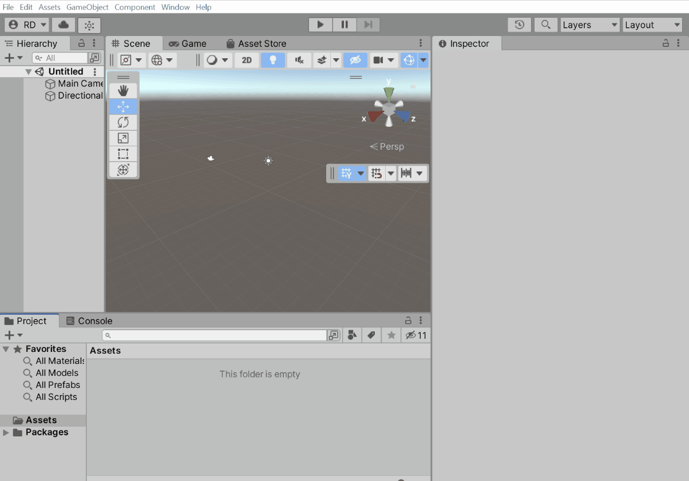
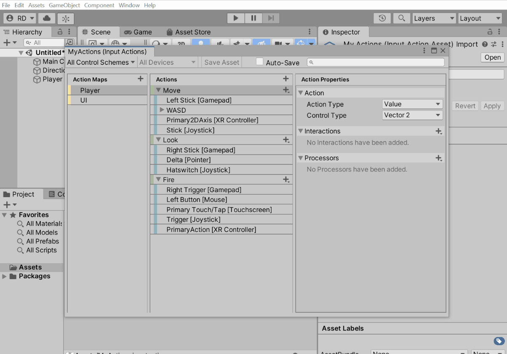
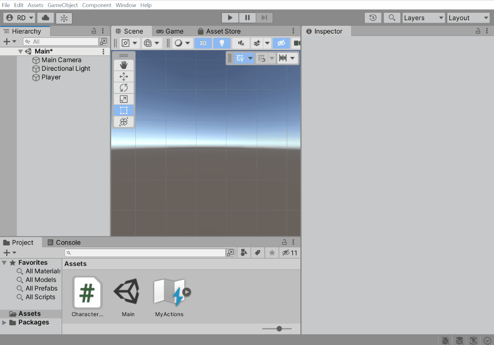
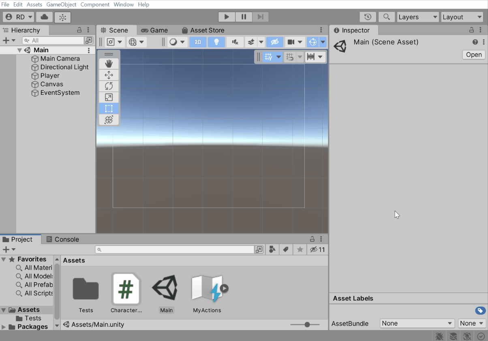
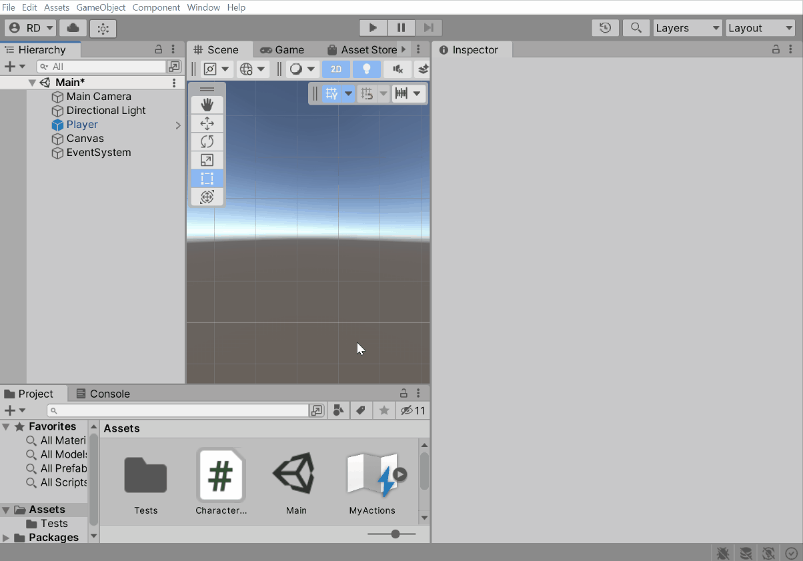
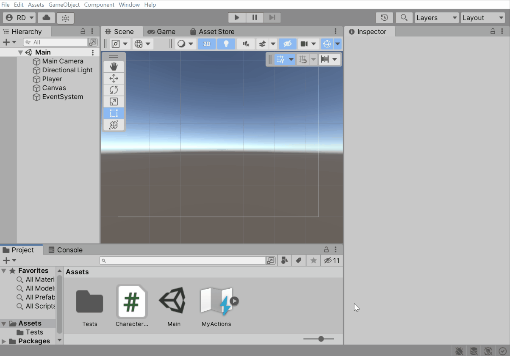
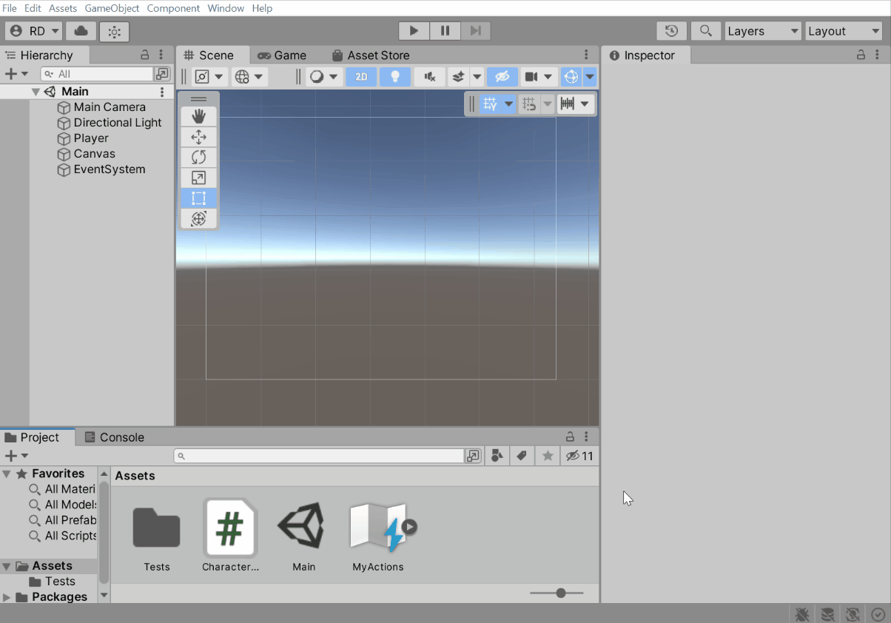
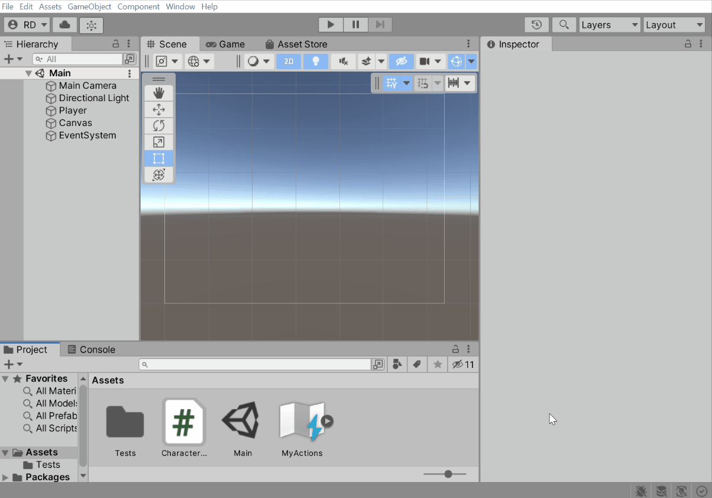

# How do I…?

Get Started:

* [... set up input in a blank project?](#set-up-input-in-a-blank-project)
* [... set up uGUI to work with the input system?](#set-up-ugui-to-work-with-the-input-system)
* [... keep using the old input system alongside the new one?](#keep-using-the-old-input-system-alongside-the-new-one)

Players:

* [... have multiple players in my game?](#have-multiple-players-in-my-game)
* [... detect when a player is switching from keyboard&mouse to gamepad?](#detect-when-a-player-is-switching-from-keyboard-mouse-to-gamepad)
* [... manually determine which control scheme and devices a player is using?](#manually-determine-which-control-scheme-and-devices-a-player-is-using)

Actions:

* [... create a button input?](#create-a-button-input)
* [... create a value input?](#create-a-value-input)
* [... create a SHIFT+B input?](#create-a-shift-b-input)
* [... create a WASD input?](#create-a-wasd-input)
* [... require a button to be pressed quickly or slowly?](#require-a-button-to-be-pressed-quickly-or-slowly)
* [... act on an input continuously every frame?](#act-on-an-input-continuously-every-frame)

Rebinding:

* [... let the user rebind an action to a different control?](#let-a-user-rebind-an-action-to-a-different-control)
* [... show in the UI what an action is currently bound to?](#show-in-the-ui-what-an-action-is-currently-bound-to)
* [... save and load rebinds?](#save-and-load-rebinds)

UI:

* [... prevent input consumed by the UI from triggering actions in the game?](#prevent-input-consumed-by-the-ui-from-triggering-actions-in-the-game)

Devices:

* [... detect when a device is connected or disconnected?](#detect-when-a-device-is-connected-or-disconnected)
* [... find out which devices are available?](#find-out-which-devices-are-available)
* [... wait for the player to press a button on any device?](#wait-for-the-player-to-press-a-button-on-any-device)
* [... read input directly from a device?](#read-input-directly-from-a-device)
* [... create my own input device?](#create-my-own-input-device)

Gamepads:

* [... let a gamepad control the mouse cursor?](#let-a-gamepad-control-the-mouse-cursor)
* [... determine whether the player is using an Xbox or PlayStation controller?](#determine-whether-the-player-is-using-an-xbox-or-playstation-controller)

Touch:

* [... read touch input as with `UnityEngine.touches`?](#read-touch-input-as-with-unityengine-touches)
* [... create a virtual joystick?](#create-a-virtual-joystick)

Keyboards:

* [... bind to the 'a' *text* input?](#bind-to-the-a-text-input)
* [... have two players use the same keyboard?](#have-two-players-use-the-same-keyboard)
* [... receive text input?](#receive-text-input)
* [... find out which text character corresponds to a key?](...)

Sensors:

* [... read gyroscope input?](#read-gyroscope-input)

Debugging:

* [... test my game on Android or iOS?](#test-my-game-on-android-or-ios)
* [... see what actions are enabled and what they are bound to?](#...)

Testing:

* [... create mock input in an automated test?](#create-mock-input-in-an-automated-test)
* [... set an action's value programmatically?](#set-an-actions-value-programmatically)
* [... record and replay input?](#record-and-replay-input)

Scripting:

* [... set up input without using MonoBehaviours?](#set-up-input-without-using-monobehaviours)
* [... listen to all input coming in?](#listen-to-all-input-coming-in)

----------------

## Get Started

### <a name="set-up-input-in-a-blank-project"></a>... set up input in a blank project?

1. Install the input system package through the Unity Package Manager as per [the documentation](Installation.md).
   
   This adds the [`UnityEngine.InputSystem`](../api/UnityEngine.InputSystem.html) API to your project and enables support for it in the native Unity runtime.<br><br>
2. Add a [`PlayerInput`](Components.md#playerinput-component) to a `GameObject`.
   
   This adds an [`.inputactions`](ActionAssets.md) asset to your project and sets up one player in the game to use those actions.<br><br>
3. Read input from the actions in script.
   
   ```C#
   public class CharacterController : MonoBehaviour
   {
       public InputActionReference fire;
       public InputActionReference move;

       public void Update()
       {
           if (fire.action.WasPressedThisFrame())
               Fire();

           var moveVector = move.action.ReadValue<Vector2>();
           Move(moveVector);
       }

       //...
   }
   ```

### <a name="set-up-ugui-to-work-with-the-input-system"></a> ... set up uGUI to work with the input system?

Go to the `EventSystem` object and click the "Replace with InputSystemUIInputModule" button. Optionally, to use your own bindings instead of the default ones, drag your custom `.inputactions` asset into the `Actions Asset` field.



This will set up uGUI to receive events generated from input defined in an [`.inputactions`](ActionAssets.md) asset. If needed, you can customize the bindings.

### <a name="keep-using-the-old-input-system-alongside-the-new-one"></a> ... keep using the old input system alongside the new one?

After [installation](Installation.md), set `Active Input Handling` in `Player Preferences` to `Both`.


----------------

## Players

### <a name="have-multiple-players-in-my-game"></a> ... have multiple players in my game?

Each [`PlayerInput`](Components.md#playerinput-component) represents one player. Having more than one `GameObject` with the `PlayerInput` component on it in the game creates multiple independent players. Each player gets assigned devices for exclusive use by that player.

#### Create a player prefab

Each player needs to be self-contained in so far as it should only respond to input from its own respective [`PlayerInput`](../api/UnityEngine.InputSystem.PlayerInput.html).



Alternatively, you can respond to input using callbacks/events:


#### Join players from a lobby

A simple lobby setup can be created using [`PlayerInputManager`](../api/UnityEngine.InputSystem.PlayerInputManager.html).



Alternatively, you can create a simple "press button to join" setup using [`InputSystem.onAnyButtonPress`](../api/UnityEngine.InputSystem.InputSystem.html#UnityEngine_InputSystem_InputSystem_onAnyButtonPress).

```C#
public class PlayerLobby : MonoBehaviour
{
    public GameObject playerPrefab;
    
    private IDisposable m_ButtonPressListener;
    
    private void OnEnable()
    {
        m_ButtonPressListener = InputSystem.onAnyButtonPress
            .Call(button =>
            {
                // Grab the device from the button control.
                var device = button.device;
                
                // Check if the device is already used by another player.
                if (PlayerInput.FindFirstPairedToDevice(device) != null)
                {
                    // It is. Ignore this button press.
                    return;
                }
                
                // It is not, so create a new player.
                var player = PlayerInput.Instantiate(playerPrefab, pairWithDevice: device);
                Debug.Log($"Player {player.playerIndex+1} joined");
            });
    }
    
    private void OnDisable()
    {
        m_ButtonPressListener?.Dispose();
    }
}
```

#### Spawn players

You can manually spawn new players using [`PlayerInput.Instantiate`](../api/UnityEngine.InputSystem.PlayerInput.html#UnityEngine_InputSystem_PlayerInput_Instantiate_XXX).

```C#
// Four players, each one on a gamepad.
PlayerInstantiate(playerPrefab, controlScheme: "Gamepad", Gamepad.all[0]);
PlayerInstantiate(playerPrefab, controlScheme: "Gamepad", Gamepad.all[1]);
PlayerInstantiate(playerPrefab, controlScheme: "Gamepad", Gamepad.all[2]);
PlayerInstantiate(playerPrefab, controlScheme: "Gamepad", Gamepad.all[3]);
```

#### Customize each player individually

----------------

## Actions

### <a name="let-a-user-rebind-an-action-to-a-different-control"></a> ... let the user rebind an action to a different control?


### <a name="save-and-load-rebinds"></a> ... save and load rebinds?

Call [`SaveBindingOverridesAsJson`](../api/UnityEngine.InputSystem.InputActionRebindingExtensions.html#UnityEngine_InputSystem_InputActionRebindingExtensions_SaveBindingOverridesAsJson_UnityEngine_InputSystem_IInputActionCollection2_) to create a string containing all rebinds for the given set of actions and [`LoadBindingOverridesFromJson`](../api/UnityEngine.InputSystem.InputActionRebindingExtensions.html#UnityEngine_InputSystem_InputActionRebindingExtensions_LoadBindingOverridesFromJson_UnityEngine_InputSystem_IInputActionCollection2_System_String_System_Boolean_) to restore rebinds from such a string.

```C#
void SaveUserRebinds(PlayerInput player)
{
    var rebinds = player.actions.SaveBindingOverridesAsJson();
    PlayerPrefs.SetString("rebinds", rebinds);
}

void LoadUserRebinds(PlayerInput player)
{
    var rebinds = PlayerPrefs.GetString("rebinds");
    player.actions.LoadBindingOverridesFromJson(rebinds);
}
```
----------------

## Devices

### <a name="find-out-which-devices-are-available"></a> ... find out which devices are available?

```C#
foreach (var device in InputSystem.devices)
{
    if (device is Keyboard)
        Debug.Log("Keyboard detected");
    else if (device is Mouse)
        Debug.Log("Mouse detected");
    else if (device is Gamepad)
        Debug.Log("Gamepad detected");
    else if (device is Touchscreen)
        Debug.Log("Touchscreen detected");
    else
        Debug.Log("Other kind of device: " + device);
}
```

### <a name="wait-for-the-player-to-press-a-button-on-any-device"></a> ... wait for the player to press a button on any device?

```C#
// Call delegate once on button press.
InputSystem.onAnyButtonPress
    .CallOnce(button => Debug.Log($"Button {button} was pressed!"));
   
// Call delegate whenever a button is pressed.
// NOTE: This will add overhead to event processing until the listener is disposed.
var listener = InputSystem.onAnyButtonPress
    .Call(button => Debug.Log($"Button {button} was pressed!"));

// To dispose of the listener.
listener.Dispose();
```

### <a name="read-input-directly-from-a-device"></a> ... read input directly from a device?

```C#
// Keyboard.
if (Keyboard.current.spaceKey.isPressed)
    Debug.Log("Space key is pressed");

// Mouse.
if (Mouse.current.leftButton.isPressed)
    Debug.Log("LMB is pressed");
var mousePosition = Mouse.current.position.ReadValue();

// Gamepad.
if (Gamepad.all[0].buttonSouth.isPressed)
    Debug.Log("A button on first gamepad is pressed");
var leftStick = Gamepad.all[0].leftStick.ReadValue();

// Generic.
var device = InputSystem.devices[0];
var buttonSouthValue = device["buttonSouth"].ReadValueAsObject(); // Allocates.
var leftStickX = ((AxisControl)device["leftStick/x"]).ReadValue();
foreach (var control in device.allControls)
    Debug.Log($"Control {control.path} = {control.ReadValueAsObject()}");
```
----------------

## Gamepads

### <a name="let-a-gamepad-control-the-mouse-cursor"></a> ... let a gamepad control the mouse cursor?

### <a name="determine-whether-the-player-is-using-an-xbox-or-playstation-controller"></a> ... determine whether the player is using an Xbox or PlayStation controller?

```C#
// Xbox/XInput.
if (gamepad is XInputController)
   Debug.Log("Using Xbox controller");
   
// PlayStation.
if (gamepad is DualShockGamepad)
   Debug.Log("Using DualShock controller");
```

For [`PlayerInput`](../api/UnityEngine.InputSystem.PlayerInput.html) such as when receiving [`OnControlsChanged`](../api/UnityEngine.InputSystem.PlayerInput.html#UnityEngine_InputSystem_PlayerInput_controlsChangedEvent).

```C#
void OnControlsChanged(PlayerInput player)
{
    if (player.GetDevice<XInputController>() != null)
        Debug.Log("Player is using an Xbox controller");
    else if (player.GetDevice<DualShockGamepad>() != null)
        Debug.Log("Player is using a PlayStation controller");
}
```

You can also utilize these classes in control schemes. For example, you can have a base "Gamepad" scheme with bindings shared between the controllers and then have additional control schemes specific to Xbox and PlayStation controllers. [`PlayerInput`](../api/UnityEngine.InputSystem.PlayerInput.html) will pick the control scheme that best matches a given controller.



>__Note:__
>
>Xbox and PlayStation and Switch controller support is available across platforms. However, when working __on__ these consoles, you will, in addition to the input system package, need the console-specific input package available through the respective licensee channels.

----------------

## Keyboards

### <a name="bind-to-the-a-text-input"></a> ... bind to the 'a' *text* input?

Use the "By Character Mapped to Key" group in the control picker instead of the "By Location of Key (Using US Layout)" group.



When manually creating actions/bindings in script:

```C#
// Bind to the key to the right of the CAPS LOCK key.
// This binding will refer to the key regardless of the language
// layout currently selected.
var action1 = new InputAction(binding: "<Keyboard>/a");

// Bind to the key that inputs the 'a' character. If no such key
// exists in the currently active language layout, the action will
// remain unbound.
var action2 = new InputAction(binding: "<Keyboard>/#(a)");
```

### <a name="have-two-players-use-the-same-keyboard"></a> ... have two players use the same keyboard?

[`PlayerInput`](../api/UnityEngine.InputSystem.PlayerInput.html) will, by default, not assign two players to the same device. However, you can manually switch players to use the same keyboard or spawn them that way from the beginning.

1. Create two separate control schemes for the keyboard.
    
2. Spawn players using the control schemes or switch existing players to them.
    ```C#
    // Spawn two players. One using WASD and one using arrows.
    PlayerInput.Instantiate(playerPrefab, controlScheme: "KeyboardWASD", pairWithDevice: Keyboard.current);
    PlayerInput.Instantiate(playerPrefab, controlScheme: "KeyboardArrows", pairWithDevice: Keyboard.current);
   
    // Alternatively, switch existing players.
    PlayerInput.all[0].SwitchCurrentControlScheme("KeyboardWASD", Keyboard.current);
    PlayerInput.all[1].SwitchCurrentControlScheme("KeyboardArrows", Keyboard.current);
    ```
   
### <a name="receive-text-input"></a> ... receive text input?

Use [`Keyboard.onTextInput`](../api/UnityEngine.InputSystem.Keyboard.html#UnityEngine_InputSystem_Keyboard_onTextInput).

```C#
Keyboard.current.onTextInput +=
    character => Debug.Log($"Char {character} input received");
```

For IME input, use [`Keyboard.onIMECompositionChange`](../api/UnityEngine.InputSystem.Keyboard.html#UnityEngine_InputSystem_Keyboard_onIMECompositionChange).

----------------
   
## Sensors

### <a name="read-gyroscope-input"></a> ... read gyroscope input?

You can read out rotation rates via [`Gyroscope.angularVelocity`](../api/UnityEngine.InputSystem.Gyroscope.html#UnityEngine_InputSystem_Gyroscope_angularVelocity).

```C#
// Turn on sensor.
InputSystem.EnableDevice(Gyroscope.current);

// Read out value.
var value = Gyroscope.current.angularVelocity.ReadValue();
```

You can read out gravity via [`GravitySensor.gravity`](../api/UnityEngine.InputSystem.GravitySensor.html#UnityEngine_InputSystem_GravitySensor_gravity).

```C#
// Turn on sensor.
InputSystem.EnableDevice(GravitySensor.current);

// Read out value.
var value = GravitySensor.current.gravity.ReadValue();
```

You can read out acceleration via [`LinearAccelerationSensor.acceleration`](../api/UnityEngine.InputSystem.LinearAccelerationSensor.html#UnityEngine_InputSystem_LinearAccelerationSensor_acceleration).

```C#
// Turn on sensor.
InputSystem.EnableDevice(LinearAccelerationSensor.current);

// Read out value.
var value = LinearAccelerationSensor.current.acceleration.ReadValue();
```

You can read out attitude via [`AttitudeSensor.attitude`](../api/UnityEngine.InputSystem.AttitudeSensor.html#UnityEngine_InputSystem_AttitudeSensor_attitude).

```C#
// Turn on sensor.
InputSystem.EnableDevice(AttitudeSensor.current);

// Read out value.
var value = AttitudeSensor.current.attitude.ReadValue();
```

These controls can also be bound in [actions](Actions.md).
   
----------------

## Debugging

### <a name="test-my-game-on-android-or-ios"></a> ... test my game on Android or iOS?

There are several ways to test your mobile game with respect to input.

#### Unity Remote

#### Device Simulator

#### Build and run player

----------------

## Testing

### <a name="create-mock-input-in-an-automated-test"></a> ... create mock input in an automated test?


1. Create a test assembly and add references for `UnityEngine.InputSystem` and `UnityEngine.InputSystem.TestFramework`.
2. Add `com.unity.inputsystem` to `testables` in your project's `manifest.json` file.

```C#
// InputTestFixture isolates input for testing. No devices and no input from the host machine.
// Automatically cleans up any input-related setup put in place by a test.
class Tests : InputTestFixture
{
   [Test] // Works with [Test] and [UnityTest].
   public void Test()
   {
      // Can add devices here or in setup. Whatever we add to or register with the
      // input system will be removed after the test has finished.
      var mouse = InputSystem.AddDevice<Mouse>();

      // Move the mouse.
      Set(mouse.position, new Vector2(123, 234));

      // Can also step input manually in tests. In a [UnityTest], this
      // happens automatically whenever Unity advances by a frame.
      InputSystem.Update();
   }
}
```

More info in the [docs](Testing.md).

### <a name="set-an-actions-value-programmatically"></a> ... set an action's value programmatically?

Actions need to be bound to controls. They do not have values by themselves.

You can create an [`InputDevice`](../api/UnityEngine.InputSystem.InputDevice.html) automatically from an [`InputActionAsset`](../api/UnityEngine.InputSystem.InputActionAsset.html) using the following function. This creates controls on the device that mirror the actions found in the asset.

```C#
// Take a set of actions and create an InputDevice for it that has a control
// for each of the actions. Also binds the actions to that those controls.
public static InputDevice SetUpMockInputForActions(InputActionAsset actions)
{
    var layoutName = actions.name;
  
    // Build a device layout that simply has one control for each action in the asset.
    InputSystem.RegisterLayoutBuilder(() =>
    {
        var builder = new InputControlLayout.Builder()
            .WithName(layoutName);
  
        foreach (var action in actions)
        {
            builder.AddControl(action.name) // Must not have actions in separate maps with the same name.
                .WithLayout(action.expectedControlType);
        }
  
        return builder.Build();
    }, name: layoutName);
  
    // Create the device.
    var device = InputSystem.AddDevice(layoutName);
  
    // Add a control scheme for it to the actions.
    actions.AddControlScheme("MockInput")
        .WithRequiredDevice($"<{layoutName}>");
  
    // Bind the actions in the newly added control scheme.
    foreach (var action in actions)
        action.AddBinding($"<{layoutName}>/{action.name}", groups: "MockInput");
  
    // Restrict the actions to bind only to our newly created
    // device using the bindings we just added.
    actions.bindingMask = InputBinding.MaskByGroup("MockInput");
    actions.devices = new[] { device };
  
    return device;
}
```

Using this function, you can, for example, do:

```C#
var mockInput = SetUpMockInputForActions(actions);
Press((ButtonControl)mockInput["fire"]);
```

### <a name="record-and-replay-input"></a> ... record and replay input?

----------------

## Scripting

### 

### <a name="set-up-input-without-using-monobehaviours"></a> ... set up input without using MonoBehaviours?


... video for "Generate C# Class"

#### Support control schemes

#### Manage multiple players

